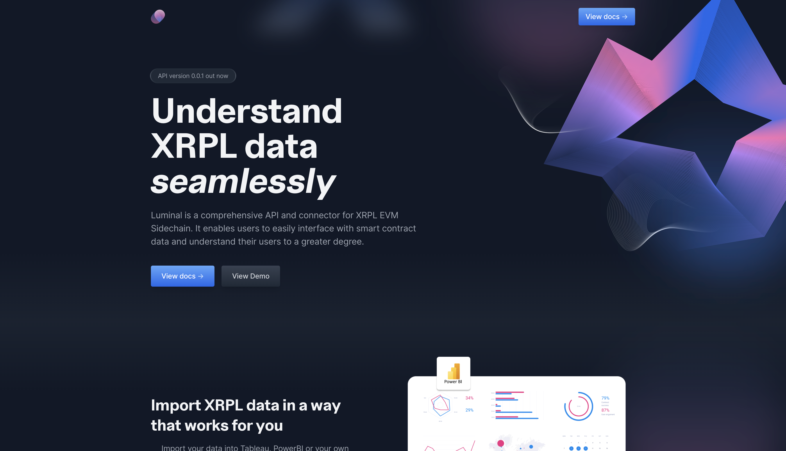

# Luminal

Luminal is an analytics application designed to help enterprises and solo dApp developers seamlessly digest and analyze XRPL (XRP Ledger) data. As the Web3 ecosystem grows, so does the need for robust, user-friendly tools to make sense of blockchain data. Luminal is here to bridge that gap with a comprehensive solution tailored to both large organizations and individual developers.

## Overview

Luminal leverages real-time data from the XRPL Block Explorer API, processes it through ETL (Extract, Transform, Load) procedures, and stores it in a PostgreSQL database. This robust backend supports our dual offerings:

1. Luminal API: Provides endpoints that enterprises can use to feed XRPL data into existing analytics platforms like Power BI and Tableau.
2. Luminal Dashboard: A customizable, plug-and-play dashboard solution for solo dApp developers and small teams, featuring easy onboarding and deep customization options.

## Features

### For Enterprises

1. Seamless Integration: Easily integrate XRPL data into existing dashboards in Power BI, Tableau, and other analytics platforms.
2. Customizable Endpoints: Utilize our API to build custom dashboards and reports tailored to specific business needs.
3. Real-time Data: Access real-time XRPL data for up-to-the-minute insights.

### For Solo Developers
1. User-Friendly Dashboards: Create and customize dashboards with minimal effort, using our intuitive drag-and-drop interface.
2. Quick Onboarding: Get started quickly with our straightforward setup process.
3. Deep Customization: Tailor your dashboards to meet specific requirements, without needing extensive coding knowledge.

## Technology Stack

1. Backend: XRPL Block Explorer API, ETL processes, PostgreSQL database.
2. API: Provides endpoints for seamless integration with external analytics tools.
3. Dashboard: Customizable and user-friendly, designed for easy setup and extensive customization.

## Local development
    
    source ./env/bin/activate
    cd luminal
     ./manage.py makemigrations --settings=luminal.settings.local
     ./manage.py migrate --settings=luminal.settings.local
     ./manage.py runserver --settings=luminal.settings.local

    
## Setup

    pip install virtualenv
    source ./env/bin/activate
    pip install -r ./luminal/requirements.txt
    
--- 

Thank you for using Luminal! We are excited to help you unlock the full potential of XRPL data.

